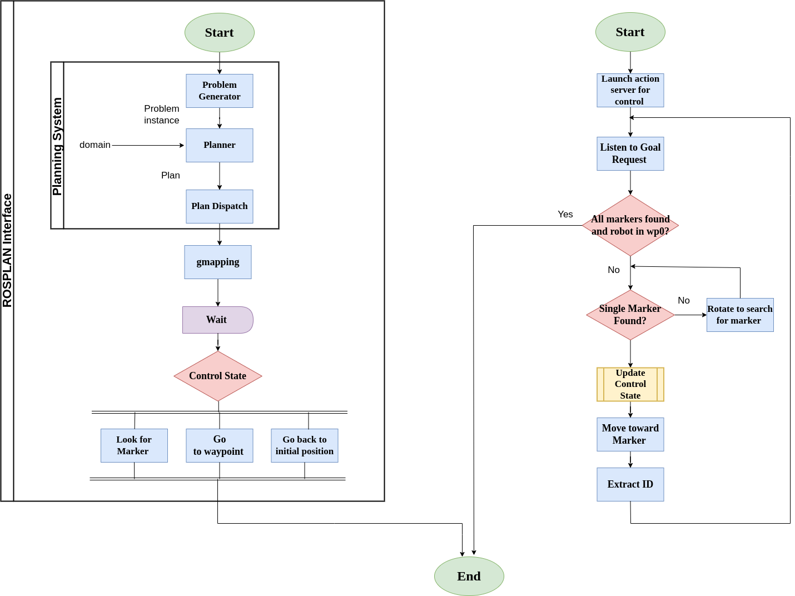

# Experimental_Assignment_2
---

# ADVICE!!

you can launch the whole project from globallaunch.launch
However, if you dont have a titan laptop (most probably it is the case) run these commands below on your shell following the same order: 

1) Start the Gazebo simulation with the ROSBot in the assignment-specific environment:
```console
roslaunch rosbot_gazebo assignment2.launch
```
2) Bring up the ROSBot:
```console
roslaunch rosbot_bringup rosbot_gazebo.launch
```

OR for 1) and 2) you can run this launch file: `fromassignment1.launch` 

3. Launch the gmapping for SLAM:
```console
roslaunch assignment2_exprob gmapping.launch
```
4. Start the move_base for autonomous navigation:
```console
roslaunch assignment2_exprob move_base.launch
```
5. Run the marker publisher node to publish ArUco marker positions:
```console
rosrun aruco_ros marker_publish
```
6. Execute the marker detection script:
```console
rosrun assignment2_exprob detectmarker.py
```
7. Launch the ROSPlan interface:
```console
roslaunch RP_interface RPlaunch.launch
```
8. Start the executor script for handling detected markers and planning:
```console
rosrun assignment2_exprob executor.py
```

## Project Overview

This project presents an autonomous navigation system tailored for a robot operating within a simulated environment, leveraging the Robot Operating System (ROS) and the ROSPlan framework. The system orchestrates the robot's movement to specific waypoints, integrates ArUco marker detection, 


---
## Overview:

The planning behavior is primarily managed by the ROSPlan package's nodes, leveraging a domain file (`rosbot.pddl`) and a problem file (`task.pddl`) located in the `/assignment_2/pddl` directory. These files outline the robot's actions and goals, facilitating the achievement of desired objectives within the simulated environment.

To execute tasks effectively, the system employs a series of nodes acting as clients to interact with the ROS ecosystem. Initially, the `go_waypoint` node directs the robot to navigate towards specified waypoints within the environment. Upon reaching each waypoint, the `marker_action` node facilitates the detection and identification of markers crucial for further task execution. Finally, the `go_init` node orchestrates the robot's return to its initial position once all tasks are completed.

These client nodes interface with relevant action servers to accomplish their respective tasks efficiently. Specifically, the `move_base` action server enables smooth navigation between waypoints, while a custom `find_marker_action.py` script is dedicated to marker identification and centering.

For seamless integration and execution of plans, the `services_pddl.py` script plays a pivotal role. It interacts with ROSPlan's services to parse domain and problem files, generate actionable plans, and dispatch tasks accordingly. The resulting plan can be accessed either directly within the `/assignment_2/pddl/plan.pddl` file or via the command `rostopic echo rosplan_planner_interface/planner_output - p`, providing insight into the planned sequence of actions.

---

### Logic and Functioning

The project logic intricately weaves together various components to enable autonomous navigation and task execution. ROSPlan's role in high-level planning, coupled with the `MyActionInterface` class orchestrating motion planning actions, ensures efficient goal fulfillment. Meanwhile, the Python script `detectmarker.py` focuses on detecting ArUco markers, crucial for environment perception and localization:

```python
# detectmarker.py

# Detect ArUco marker
detected_marker = detect_aruco_marker()

# Process the detected marker
if detected_marker:
    # Update marker status and continue navigation
    update_marker_status()
    continue_navigation()
```

By integrating these components and their respective logic, the project facilitates autonomous navigation, marker detection, and task execution, ensuring robust performance even in dynamic environments.

---

## Flowchart

<p align="center">
  
</p>

### Future Improvement
- Initially, one of the waypoints was not set correctly so the robot was not able to detect the marker. This posed a problem because we set the condition for the robot to complete all his tasks and return to wp0 is to strictly find all of the 4 markers. 
Instead it could be better to set the condition to 3 markers instead for example and also introduce a timer for the robot to search for the marker. 
If the robot exceed the time set, the marker could be set to found or not found. 

- The method used for the robot navigation is gmapping but other methods could be used such as: HectorSLAM or Cartographer. These are better optimized for real-time localization, mapping and dynamic environments.

- It is important to note the robot was able to find and detect the markers only because the waypoints were provided in advance. The waypoints are the approximate positions of the marker where it can be detected from the camera lidar field of view. 
Therefore, we should consider the scenario where the robot does not know in advance where the markers are placed. We can set the robot to look for markers while it is navigating the environment, but that would be computationally heavier and longer.

---

Contributors:
- Karim Triki [@karim7tr](https://github.com/karim7tr)
- Roumaissa Benkredda[@benkredda](https://github.com/benkredda)
- Ines Haouala[@Fritta013](https://github.com/Fritta013)
  
